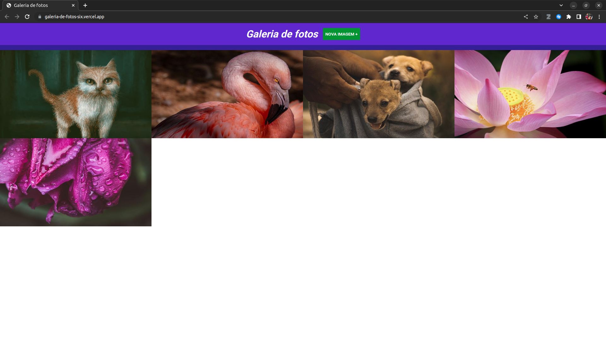

# Aplicação Web Galeria de Fotos
### Licença vinculada ao repositório: 

#

### Tecnologias utilizadas: 

 
    
    
    
     

#
### Explicando o projeto:
1. Na pagina inicial podemos ver algumas imagem e um botão, e nele escrito **Nova Imagem+**. Ao clicar nele uma vez sera aberto um menu para adicionar novas urls de imagem que você queria adicionar. para fechar esse menu você pode simplesmente clicar novamente no **Nova Imagem+** ou clicar em cancelar.

2. Ao clicar em **Nova Imagem+**, nos aparece um menu com um campo para preencher com a url, preencha esse campo com essa url de exemplo que a url correspondente a minha capa do facebook: **https://scontent.fplu29-1.fna.fbcdn.net/v/t1.6435-9/76654422_1405652156262571_6295546634226892800_n.jpg?_nc_cat=109&ccb=1-7&_nc_sid=e3f864&_nc_eui2=AeH1tYdq1LofkKCDj5YSt7U6mb7V9TsfU9GZvtX1Ox9T0YcZCYa5054iew7NriyI0ASVyEeXeDaaeDA-Yi4HAeZl&_nc_ohc=SNCEr2mQe0gAX_9uw7u&_nc_ht=scontent.fplu29-1.fna&oh=00_AfB5TMxgxjT04IyN3I95gTkOG3HElO12f43z8HGxlAtAbQ&oe=639DF577** 

#

### [Para ver o projeto hospedado na vercel click aqui!](https://galeria-de-fotos-six.vercel.app/).

